# 现实osm地图制作UE地图和sionna地图指南

## I.osm地图下载

在JOSM软件中下载osm地图。

## II.osm地图制作sionna仿真地图

### 0.安装插件

blender中安装blosm插件和mitsuba-blender插件。

### 1.导入osm

在右侧边栏打开Blosm选项卡，Import处选择file，不要选择server。server是用来从osm服务器下载地图的。但是现在已经从JOSM下载了osm地图了，就不用再在服务器里下了。选择文件，然后只勾选Import buildings，取消勾选import as a single object，然后点击import导入osm地图至blender中。

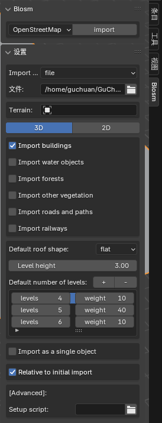

### 2.创建地面

导入的地图是没有地面的，所以需要自己画一个地面。点击添加-网格-平面。这会在世界原点处生成一个小平面。

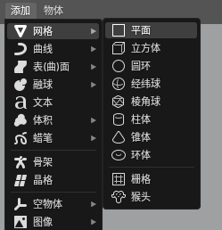

可以在缩放处选择缩放倍数。

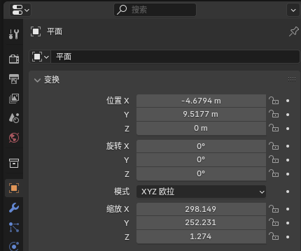

如果想要精细化调整，可点击缩放按键来精细化调整。同时也可以点击移动按钮来移动平面。

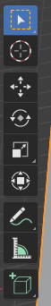

### 3.修改材质

将所有对象的材质名称都修改成符合sionna规范的材质名。

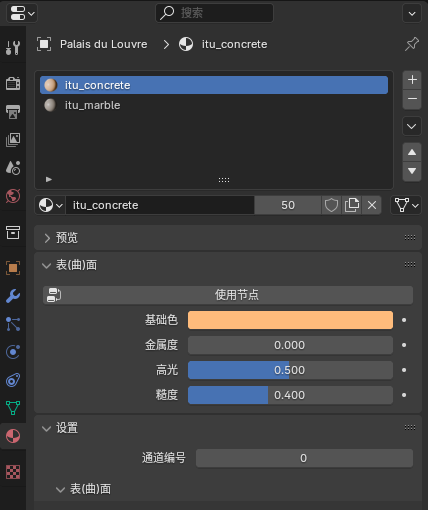

### 4.提升亮度

将世界环境亮度提升至一个合适的水平

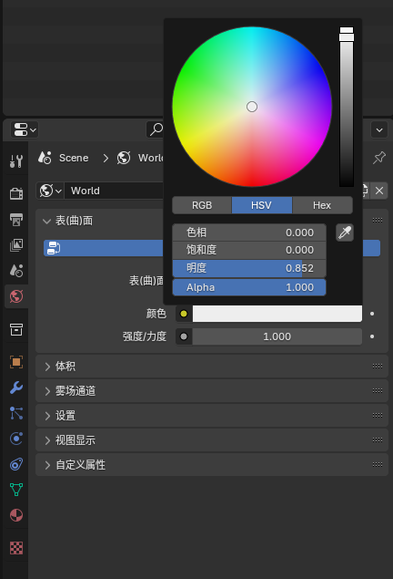

### 5.导出

导出mitsuba文件。注意勾选export IDs和选择方向为Y向前，Z向上。

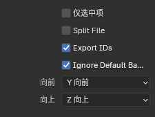

## III.osm地图制作UE地图

### 1.使用osm2world将osm地图转为glb格式

在下载的osm2world源码的目录下，运行：

```bash
./osm2world.sh -i 输入的osm地图的路径.osm -o 输出的glb地图的路径.glb
```
必须得是glb格式。这个格式能够承载最多的纹理。如果osm文件里面有坏数据，部分元素将无法转到glb中。您可以选择在JOSM软件里面手动补齐或者尝试其他区域。请注意查看glb的大小，如果为0字节那么就说明转换失败了，osm里面有坏数据。

### 2.在UE中启用插件以导入glb/glTF格式文件

在UE中，搜索插件“DataSmith glTF Import”，启用此插件。然后在上方的工具栏中点击“Datasmith”，选择刚刚导出的glb文件。

保持以下选项，注意import uniform scale一定要设置为100。

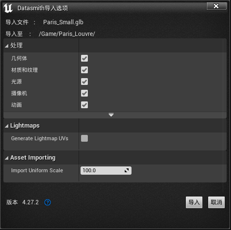

### 3.修改mesh碰撞属性

如果遇到airsim中无人机穿过地面掉下去，或者无人机穿墙而过，则需要修改场景中静态网格体的碰撞属性。

场景中的静态网格体一般存储在元素存储位置的Geometries文件夹中。在内容浏览器的场景元素中找到Geometries文件夹，进入后就能够看到所有的静态网格体。我们需要将其的碰撞属性全部修改。全选所有静态网格体，右键，在菜单中选择“通过属性矩阵进行批量编辑”。

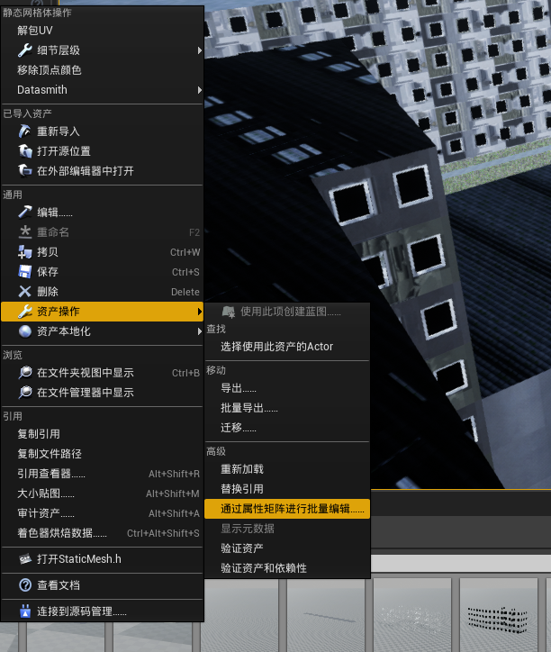

在打开的页面中搜索“collision”，在“碰撞复杂度”中选择“将复杂碰撞用作简单碰撞”。然后所有静态网格体就具有了碰撞属性。无人机就可以与之发生碰撞了。

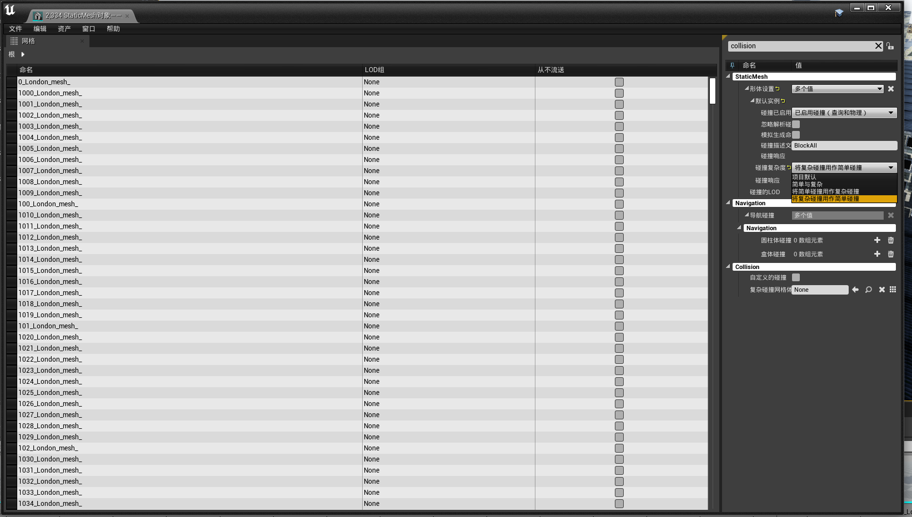

如果不想对多个静态网格体进行碰撞属性的编辑，只对一个静态网格体编辑碰撞属性，就直接在内容浏览器中双击该元素，在弹出来的页面中找到“碰撞复杂度”，如法炮制。

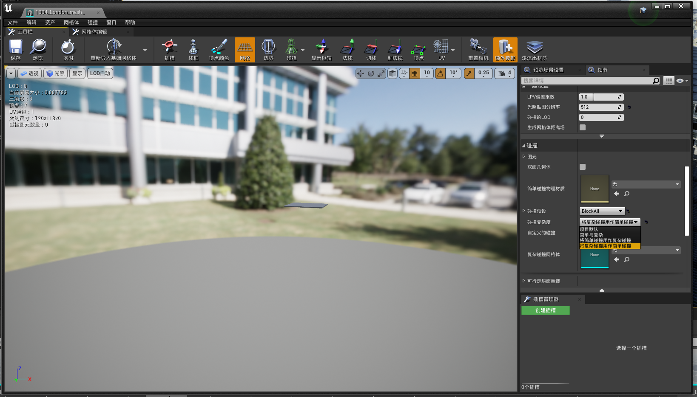

### 4.UE4光照设置

不要使用静态光源，不要使用烘焙静态光源，否则很容易出现墙面脏的情况。

将SkyLight和LightSource两项，在“细节”面板的“移动性”里选择“可移动”

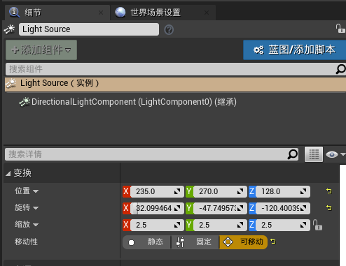

在上方菜单的“构建”中选择“仅构建光照”，重新编译光照。

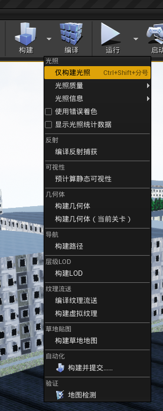

## IV.制作用于GUI的3D预览器的预览地图

glb格式地图遵循Y向上的坐标系规则。但是blender和惯用系都是Y向前和Z向上的方向。在GUI所使用的“3D坐标系”中，也是规定Y向前和Z向上。因此需要将glb转为Y向前Z向上的版本来适应其他坐标系，使预览画面正确。

将glb地图导入blender中。什么操作都不用做，直接导出为glb格式。导出时在变换选项中取消勾选“+Y向上”，再导出。得到的版本就是Y向前，Z向上的版本。可以用于GUI的3D预览视图。

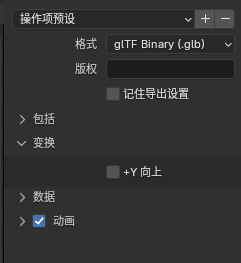